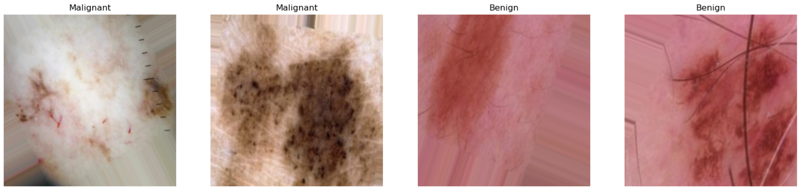

# Machine Learning Portfolio

This is a github repository dedicated to my machine learning projects

# Image Classification

### [Classifying Gaelic football kits](ImageClassification/gaelicJerseys.ipynb)

- Webscraped images of Gaelic football kits from the internet
- Trained a CNN to classify the different Gaelic football kits
- Across 33 classes, accuracy of 0.9421 was achieved

### [Classifying MNIST Dataset](ImageClassification/mnist.ipynb)

- Training a CNN to classify the different numbers from the famous MNIST dataset (from  [Kaggle Competition](https://www.kaggle.com/competitions/digit-recognizer/overview))
- Accuracy on the test dataset: 0.99503
- Position: 95 / 1,545 on Kaggle Leaderboards (as of 11th March 2024)

### [Classifying Melanoma Cancer Type](ImageClassification/mnist.ipynb)

- Training a CNN to classify the type of melanoma cancer as Benign or Malignant
- Accuracy on the test dataset: 0.8635

# Tabular Regression

### [Classifying MNIST Dataset](ImageClassification/mnist.ipynb)

# Tabular Classification

### [Iris Flowers](ImageClassification/mnist.ipynb)
- Simple
- - Accuracy on the test dataset: 1.0

